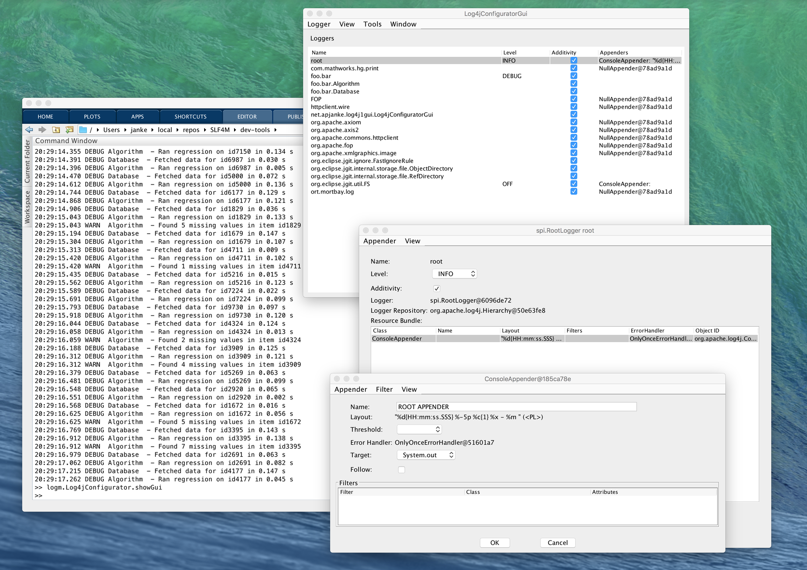

# SLF4M

[](https://www.mathworks.com/matlabcentral/fileexchange/66157-apjanke-slf4m)

SLF4M is a simple but flexible logging framework for Matlab, built on top of [SLF4J](https://www.slf4j.org/) and [Apache Log4j](https://logging.apache.org/log4j/2.0/). You can use it to do runtime-configurable logging from your Matlab scripts and programs. This can be more informative and more manageable than commenting in and out `fprintf()` statements.

SLF4M provides:

* Logging functions (a Matlab layer of bindings for SLF4J)
* A "Dispstr" API for customizing object display.
* A Log4j configuration GUI

The API is simple enough that you can get up and running with it quickly, or even use it casually in scripts, but it’s flexible and powerful enough to be useful for larger systems.

(The `dispstr` part is mostly optional; you don't have to learn it in order to use SLF4M logging.)



## Usage

To install, unzip the distribution somewhere, and add its `Mcode/` directory
to your Matlab path.

In your Matlab program:

* Call `logger.initSLF4M()` to initialize SLF4M. This needs to be done before any logging calls are made.
* Call `logger.Log4jConfigurator.configureBasicConsoleLogging()`
to set up basic logging. This will write log output to the Matlab console.

The logging functions are in the `+logger` package. Call them from within your Matlab
code. In order of logging level, they are:

* logger.error()
* logger.warn()
* logger.info()
* logger.debug()
* logger.trace()

The logging functions take sprintf()-style formatting arguments. You can also pass
an `MException` as the first argument to include the error message and stack
trace in the log message.

```matlab
function helloWorld(x)

if nargin < 1 || isempty(x)
    x = 123.456;
    % These debug() calls will only show up if you set log level to DEBUG
    logger.debug('Got empty x input; defaulted to %f', x);
end
z = x + 42;

logger.info('Answer z=%f', z);
if z > intmax('int32')
    logger.warn('Large value z=%f will overflow int32', z);
end

try
    some_bad_operation(x);
catch err
    logger.error(err, 'Something went wrong in some_bad_operation(x=%f)', x);
end

end
```

The output looks like this:

```text
>> helloWorld
16:53:18.279 INFO helloWorld() - Answer z=165.456000
16:53:18.291 ERROR helloWorld() - Something went wrong in some_bad_operation(123.456000)
Undefined function 'some_bad_operation' for input arguments of type 'double'.
Error in helloWorld (line 16)
    some_bad_operation(x);
```

Thanks to `dispstr()`, you can also pass Matlab objects to the `%s` conversions.

```text
>> m = containers.Map;
>> m('foo') = 42; m('bar') = struct;
>> logger.info('Hello, world! %s', m)
09:52:29.809 INFO  base - Hello, world! 2-by-1 containers.Map
```

To launch the configuration GUI, run `logger.Log4jConfigurator.showGui`. This GUI lets you set the logging levels and other attributes of the various loggers in your Matlab session.

For more details, see the [User's Guide](doc/UserGuide.md).

## Requirements

A kind of recent version of Matlab. SLF4M was developed and tested on Matlab R2016b and R2017b, but it will probably work on some older Matlab versions too.

## Implementation

SLF4M is a thin layer built on top of SLF4J and Log4j. It is compatible with any other Java or Matlab code that uses SLF4J or Log4j.

Log4j was chosen as the back-end because that’s what ships with Matlab.

## License

SLF4M is dual licensed under the business-friendly Apache 2.0 and BSD 2-clause licenses. Pick whichever you like.

## Author

SLF4M is developed by [Andrew Janke](https://apjanke.net). Its home page is [the repo on GitHub](https://github.com/apjanke/SLF4M).
